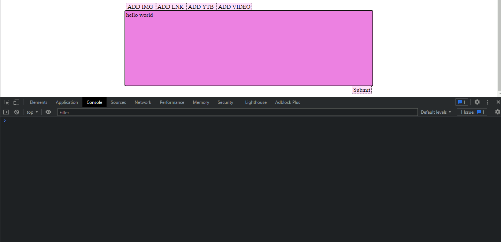

# nuTextArea
I think the default html textarea is a little lack luster, here is my attempt at making a more integrated text area for my purposes. 
This text area supports images, videos, and links in the textarea as opposed to being just raw text. It uses a div with content editable plus a few other small extensions so that is mimics that of the HTML textarea.

[TRY IT HERE just an html link](https://zeronerodahero.github.io/archive/nuTextArea.html)

## Usage
In the repository, there is an html file that is just the example, there is also a js and css file for separate use. The html is purely for example use only. The css and js is what you might want to see. The code is abou the same.
If you want to copy it, you should include both the js and stylesheet in your header. You just need to append *generateTextArea()* to the right place. See template.html for example.

Anyways, for including images, links and videos, you can copy links and images as html supports that. However, I highly advise against using that because it raises a few problems[see problems]. 
I solved this problem by using my format for inserting images. For example, the user just presses the button and inserts the link. Or the user can type \[selector\]\(link\).
The available selectors are:
* IMG (for img)
* LNK (for links)
* YTB (for youtube)
* VIDEO (for videos)

To

## Problems
* The newline problem: Images need a newline below them so that the users can scroll and append text past the images. If you do not have a newline there, HTML makes the image the last child and you cannot add text to the end. This is content-editable's short comming. There is a solution, but I just haven't figured it out yet. For now, this works ok. And I want to get something out. This is also why we need selector. \[To be solved]
